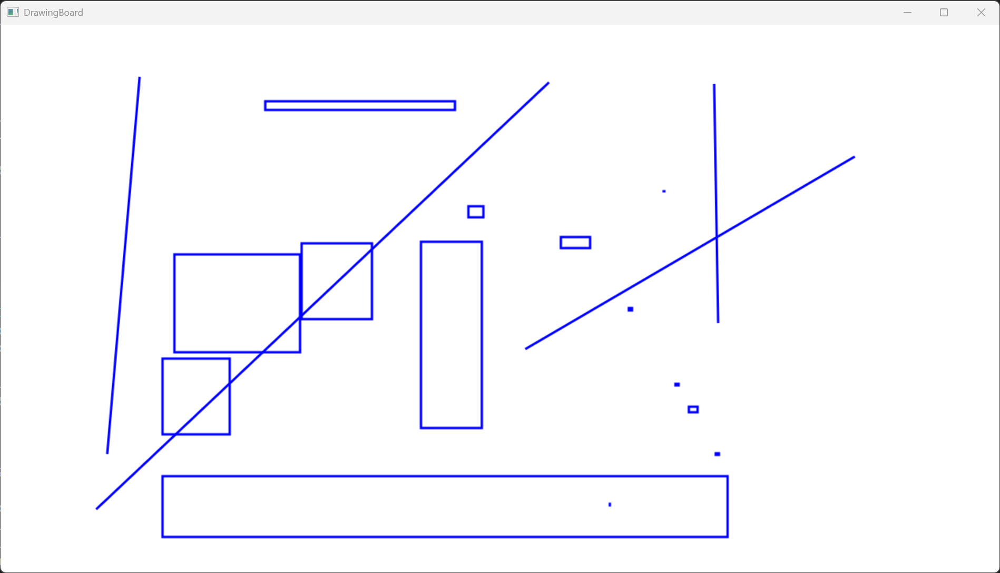
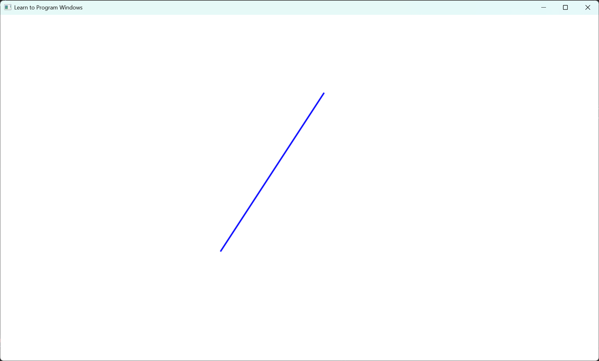
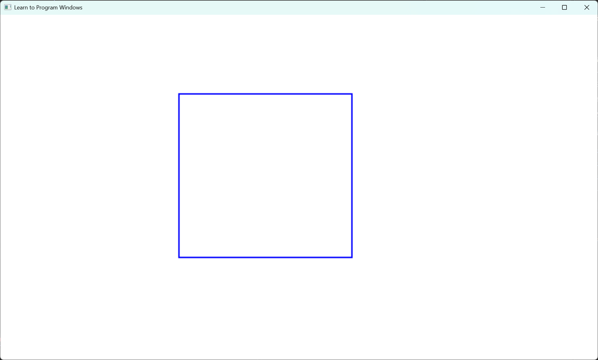

# DrawingBoard
win32的窗口项目，实现一个简单的画板，要求实现绘制线段、矩形功能

## 需求分析 

1. 创建窗口

2. 鼠标输入

3. 图形绘制

## 思路

1. 创建一个窗口

2. 处理鼠标消息, 获取光标坐标

3. 左键按下确定线段起点, 左键松开确定线段终点, 右键按下确定矩形左上, 右键松开确定矩形右下

4. 将两个点存储在数组里

## 搭建项目

- 创建main.cpp, 定义程序入口

- 设计MainWindow类，大体参照[官方示例](https://github.com/microsoft/Windows-classic-samples/blob/main/Samples/Win7Samples/begin/LearnWin32/BaseWindow/cpp/main.cpp)

- 在main.cpp中创建MainWindow

## 结果展示
鼠标左键绘制线段, 右键绘制矩形


## 测试

可以正常绘制线段，绘制矩形

鼠标快速滑动，离开屏幕或是快速晃动屏幕，改变屏幕大小都没有出现bug。

## 遇到的问题

1. 因为是第一次写win32窗口, 之前没接触过, 我就先分析需求, 确定需要学哪些内容, 然后去看官方文档和示例, 确认完成所有的先决条件后在开始搭建项目

2. 在初步完成编码后遇到一个空指针错误, 关于MainWindow类的 WindowProc, 因为WindowProc为静态函数, 我需要给他this指针使用, 结果this为空, 我又对比了官方示例, 发现是CreateWindowEx最后一个参数的问题: 应该传this，我传的NULL

3. 在初步完成后, 进行测试绘制线段时发现一个bug: 点击时会与上一个"终点"连线, 我又仔细看了代码逻辑, 发现问题是松开左键时没有更新"终点"。

## 心得

- 官方示例还是要仔细看, 本次项目就参考的大量官方示例

- 把大问题分解成小问题一个一个解决, 确定需要先学习哪些前置, 先处理这些前置

- 理清思路后再开始编码, 这样找bug也好找

# LearnWin32

## 创建窗口

[案例来源](https://github.com/microsoft/Windows-classic-samples/blob/main/Samples/Win7Samples/begin/LearnWin32/HelloWorld/cpp/main.cpp)


### 窗口类

``` c++
const wchar_t CLASS_NAME[]  = L"Sample Window Class";

WNDCLASS wc = { };

// WindowProc 将定义大部分行为 (如鼠标点击、键盘输入、重绘、关闭)
wc.lpfnWndProc   = WindowProc;
// 用于标记当前窗口属于那个进程
wc.hInstance     = hInstance;
// 命名窗口
wc.lpszClassName = CLASS_NAME;
```

### 创建窗口

``` c++
HWND hwnd = CreateWindowEx(
    0,                              //  扩展窗口样式
    CLASS_NAME,                     //  窗口类名称
    L"Learn to Program Windows",    // 窗口标题
    WS_OVERLAPPEDWINDOW,            // 窗口样式

    // x坐标，y坐标，宽度，高度
    CW_USEDEFAULT, CW_USEDEFAULT, CW_USEDEFAULT, CW_USEDEFAULT,

    NULL,       // 父窗口句柄    
    NULL,       // 菜单句柄
    hInstance,  // 实例句柄
    NULL        // 额外创建数据
    );

if (hwnd == NULL)
{
    return 0;
}
```

## 消息处理

处理鼠标点击和移动消息，将坐标打印到屏幕中间。


### 窗口消息

用户按下鼠标左键，窗口将收到一条消息，消息代码如下。

``` c++
#define WM_LBUTTONDOWN    0x0201
```

### 消息循环

对于创建窗口的每个线程，操作系统都会为窗口消息创建队列。可以通过调用 GetMessage 函数从队列拉取消息。

``` c++
MSG msg;
GetMessage(&msg, NULL, 0, 0);
```

此函数从队列的头中删除第一条消息。 如果队列为空，该函数将阻塞，直到另一条消息进入队列。

尽管 MSG 结构包含有关消息的信息，但您几乎永远不会直接检查此结构。 而是将它直接传递给另外两个函数。

``` c++
TranslateMessage(&msg); 
DispatchMessage(&msg);
```

TranslateMessage 函数与键盘输入相关。 它将击键（按下按键，松开按键）转换为字符。 您不必了解此函数的工作原理；只需记得在 DispatchMessage 之前调用它即可。

DispatchMessage 函数告诉操作系统调用消息目标窗口的窗口过程。 换句话说，操作系统会在其窗口表中查找窗口句柄，找到与窗口关联的函数指针，并调用该函数。

例如，假设用户按下鼠标左键。 这会引发一连串事件：

1. 操作系统在消息队列上放置 WM_LBUTTONDOWN 消息。
2. 程序调用 GetMessage 函数。
3. GetMessage 从队列中提取 WM_LBUTTONDOWN 消息，并填写 MSG 结构。
4. 程序调用 TranslateMessage 和 DispatchMessage 函数。
5. 在 DispatchMessag 中，操作系统调用窗口过程。
6. 窗口过程可以响应消息或忽略它。

### 编写窗口过程

DispatchMessage 函数调用窗口的窗口过程，该窗口是消息的目标。 窗口过程具有以下签名。

``` c++
LRESULT CALLBACK WindowProc(HWND hwnd, UINT uMsg, WPARAM wParam, LPARAM lParam);
```

通常有四个参数。

- hwnd 是窗口的句柄。
- uMsg 是消息代码；例如，WM_SIZE 消息指示窗口已调整大小。
- wParam 和 lParam 包含与消息相关的其他数据。 具体含义依赖于消息代码。

## 鼠标输入

### 响应鼠标单击

如果用户在光标位于窗口工作区上时单击鼠标按钮，该窗口将收到以下消息之一。

| 消息                |  含义
|-----------          | --- 
|WM_LBUTTONDOWN       | 按下左键
|WM_LBUTTONUP         | 松开左键
|WM_MBUTTONDOWN       | 按下中键
|WM_MBUTTONUP         | 松开中键
|WM_RBUTTONDOWN       | 按下右键
|WM_RBUTTONUP         | 松开右键

### 鼠标坐标

在所有这些消息中，lParam 参数包含鼠标指针的 x 坐标和 y 坐标。

``` c++
int xPos = GET_X_LPARAM(lParam); 
int yPos = GET_Y_LPARAM(lParam);
```

## 图形绘制

[代码参考](https://learn.microsoft.com/zh-cn/windows/win32/learnwin32/your-first-direct2d-program)

按下鼠标左键开始画线


按下鼠标右键开始绘制矩形


关于d2d绘图:
``` c++
// 创建 D2D 资源
HRESULT MainWindow::CreateGraphicsResources() {
    HRESULT hr = S_OK;
    if (m_pRenderTarget == NULL)
    {
        RECT rc;
        GetClientRect(m_hwnd, &rc);

        D2D1_SIZE_U size = D2D1::SizeU(rc.right, rc.bottom);

        hr = m_pFactory->CreateHwndRenderTarget(
            D2D1::RenderTargetProperties(),
            D2D1::HwndRenderTargetProperties(m_hwnd, size),
            &m_pRenderTarget);

        if (SUCCEEDED(hr))
        {
            const D2D1_COLOR_F color = D2D1::ColorF(0, 0, 256);
            hr = m_pRenderTarget->CreateSolidColorBrush(color, &m_pBrush);
        }
    }
    return hr;
}

template <class T> static void SafeRelease(T** ppT)
{
    if (*ppT)
    {
        (*ppT)->Release();
        *ppT = NULL;
    }
}
// 释放 D2D 资源
void MainWindow::DiscardGraphicsResources() {
    SafeRelease(&m_pRenderTarget);
    SafeRelease(&m_pBrush);
}
```

让静态函数可以调用成员:
``` c++
LRESULT CALLBACK MainWindow::WindowProc(HWND hwnd, UINT uMsg, WPARAM wParam, LPARAM lParam)
{
    MainWindow* pThis = NULL;

    if (uMsg == WM_NCCREATE)
    {
        // 从 CREATESTRUCT 中提取 this 指针
        CREATESTRUCT* pCreate = (CREATESTRUCT*)lParam;
        pThis = (MainWindow*)pCreate->lpCreateParams;

        // 保存到窗口的用户数据中
        SetWindowLongPtr(hwnd, GWLP_USERDATA, (LONG_PTR)pThis);

        // 保存窗口句柄到对象
        pThis->m_hwnd = hwnd;
    }
    else
    {
        // 从窗口的用户数据中取出 this 指针
        pThis = (MainWindow*)GetWindowLongPtr(hwnd, GWLP_USERDATA);
    }

    if (pThis)
    {
        // 调用成员函数！
        return pThis->HandleMessage(uMsg, wParam, lParam);
    }
    else
    {
        return DefWindowProc(hwnd, uMsg, wParam, lParam);
    }
}
```